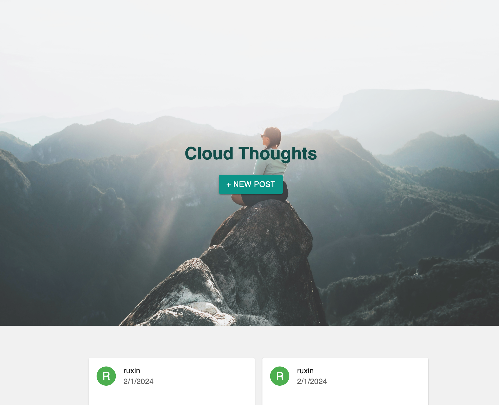

# cloud-thought

## Description

- A blog website where users can post their thoughts and upload images.

- The application is deployed on an [Azure Standard B2als v2](https://learn.microsoft.com/en-us/azure/virtual-machines/basv2) virtual machine, with a self-hosted runner to facilitate CI/CD workflows through GitHub Actions.

- Thoughts are stored in [Amazon DynamoDB](https://aws.amazon.com/dynamodb/), while images are stored in an [Amazon S3 bucket](https://aws.amazon.com/s3/). The application follows the Infrastructure as a Service (IaaS) model.

View the deployed website: http://20.29.208.6

## Usage

Enter your name and thoughts, then click 'Submit' to post a thought. Click on the avatar of each thought card to view all posts from that user.

### Screenshot(s)

## Technologies Used

- Amazon Web Services
- Microsoft Azure
- Github Action
- Express
- Multer

## Contact

ruxinqu@gmail.com or open an issue on this repository
